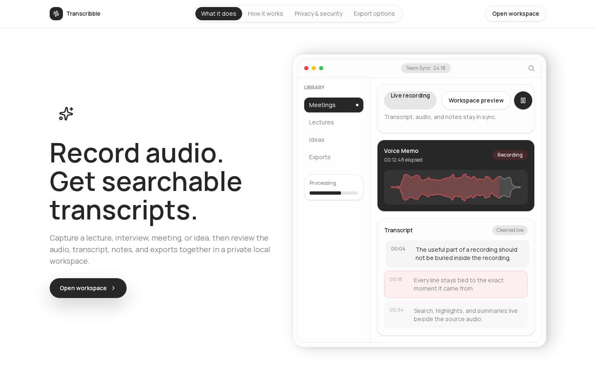

# Transcribble

  

  

Public guide for Transcribble, a transcription, decoding, and conversion tool for files.

**Live:** [https://transcribble.dylanwlim.com](https://transcribble.dylanwlim.com)

**Status:** Live public product surface.

## What It Does

- Documents the public Transcribble surface and core user workflow.
- Explains capture/import, review, organization, and export concepts at a product level.
- Keeps private implementation and user files out of public documentation.

## Who It Is For

People working with audio, transcript, decoding, and file-conversion workflows.

## Key Features

- File workflows
- Transcript review
- Export paths
- Productivity-focused interface

## Public Docs

- [Overview](docs/overview.md)
- [Getting started](docs/getting-started.md)
- [FAQ](docs/faq.md)
- [Data handling](docs/data-handling.md)
- [Changelog](CHANGELOG.md)
- [Security](SECURITY.md)
- [Contributing](CONTRIBUTING.md)

## Privacy And Source Code

Production source code, private implementation details, secrets, internal routes, proprietary logic, and non-public data are intentionally omitted. This repository documents only the public product surface, safe usage notes, and support paths.

## Contact

- Website: [https://dylanwlim.com](https://dylanwlim.com)
- GitHub: [https://github.com/dylanwlim](https://github.com/dylanwlim)
- Email: [dylan@wlim.work](mailto:dylan@wlim.work)
