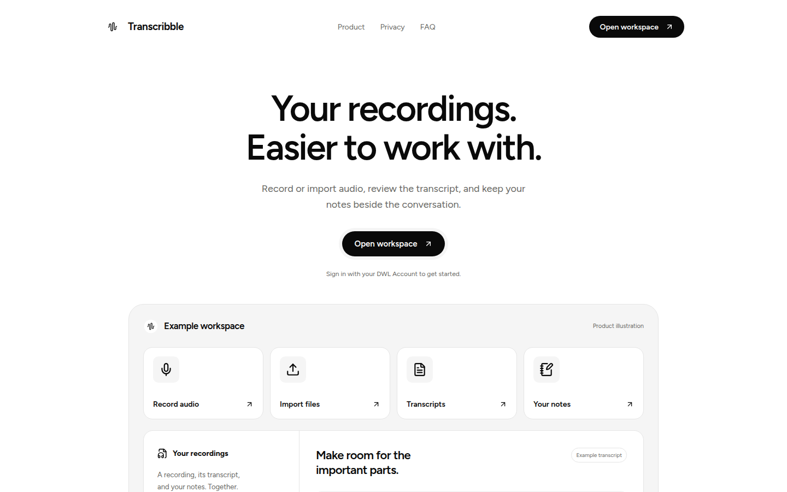

# Transcribble

Record, transcribe, and find the moment you need. Keep your audio, transcript, and notes together.

**[Open Transcribble](https://transcribble.dylanwlim.com)** · [Quick start](setup.md) · [User guide](product-guide.md) · [Help](faq.md)

  

## What you can do

- Record audio or import an audio or video file.
- Listen, review the transcript, and add notes.
- Organize recordings into folders.
- Export text, captions, or a recording backup.
- Enable optional account saving to use saved work on another device.

Sign in with your DWL Account to open the workspace. Review transcripts for accuracy and keep a backup of important recordings.

## Guides and support

| Guide | Find what you need |
| --- | --- |
| [Quick start](setup.md) | Open the workspace and make your first recording. |
| [User guide](product-guide.md) | Record, edit, organize, save, and export. |
| [Help and FAQ](faq.md) | Resolve missing recordings and transcription problems. |
| [Privacy and your recordings](security-and-privacy.md) | Choose what to save and protect your work. |

Questions or feedback? [Contact Dylan](mailto:dylan@wlim.work).
